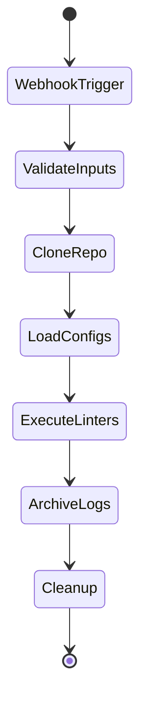

# Static Analysis Controller Playbook

## Overview
```plaintext
Webhook-driven Ansible playbook that orchestrates linting for Terraform\/Ansible\/Docker\/Jenkinsfiles
```

## File Location
```plaintext
devops_CI_CD\/ansible\/playbooks\/static_analysis\/master_lint.yml
```

## Requirements
```plaintext
1. Jenkins webhook must provide:
   - BRANCH_NAME
   - EXECUTION_MODE (sequential|parallel|single)
   - TARGET_LINTER (if mode=single)

2. Required directory structure:
   \/workspace\/gitea\/devops_CI_CD\/ansible\/config\/vars.yml
```

## Input Variables
| Variable | Source | Example | Required |
|----------|--------|---------|----------|
| `execution_mode` | Jenkins parameter | `sequential` | Yes |
| `target_linter` | Jenkins parameter | `terraform` | Only for single mode |
| `branch_name` | Webhook env var | `feature\/123` | Yes |

## Execution Flow


## Output Files
```plaintext
\/workspace\/gitea\/devops_CI_CD\/logs\/
  └── {{ branch_name }}_results.tgz
    ├── terraform.json
    ├── ansible.json
    ├── docker.json
    └── jenkinsfile.json
```

## Usage Examples
```bash
# Sequential scan
ansible-playbook master_lint.yml -e "execution_mode=sequential"

# Parallel scan
ansible-playbook master_lint.yml -e "execution_mode=parallel"

# Single linter
ansible-playbook master_lint.yml -e "execution_mode=single target_linter=ansible"
```

## Error Handling
```plaintext
1. Fails if BRANCH_NAME not set
2. Continues on linter errors (per-file)
3. Always archives available results
```